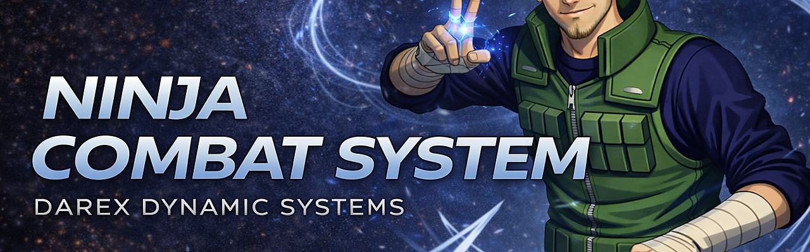

# NinjaCombatComponent

**A data-driven, multiplayer-ready melee combat plugin for Unreal Engine 5**  
*by Darex Dynamic Systems*

> 🛒 **Available on Fab** — [Link coming soon]

---

<!-- Replace the line below with your actual banner image once you have one -->
<!--  -->

---

## What Is This?

NinjaCombatComponent is a complete melee combat framework for Unreal Engine 5.  
Built for competitive action games in the style of **Naruto: Ultimate Ninja Storm**, **Boruto: Shinobi Striker**, and arena fighters.

Everything is configured through **DataAssets** — no C++ required.  
Drop the components onto your character, create a DataAsset, wire three inputs, and you have a working combo system in minutes.

---

## Features

### ⚔️ Combat
- **Combo chains** — multi-step attacks with buffered input and animated notify windows
- **Single actions** — launcher and special attacks via GameplayTags
- **Block & Guard Meter** — chip damage, guard break, configurable drain rate
- **Parry system** — tight reaction window with custom FX and reaction montages
- **Dash with I-frames** — cancel rules, cooldown, directional dodge
- **Hit Stop** — freeze-frame on impact for satisfying hit feel
- **Super Armor** — configurable flinch immunity per attack

### 🌀 Air Combat
- **Launch attacks** — send enemies airborne into a juggle state
- **Juggle routing** — configurable multi-step air combos via DataAsset
- **Air drift control** — horizontal drift velocity fully configurable

### 💥 Hit Reactions
- **Directional reactions** — Front / Back / Left / Right montages
- **HitStrength tiers** — Normal / Interrupt / KnockBack / KnockDown / Launch
- **Knockdown & get-up** with quick rise option
- **Ragdoll on death**

### 🎯 Targeting
- **Target Assist** — soft aim correction for close-range attacks
- **Lock-On system** — cone-based acquisition, LOS check, auto-break on death
- **Target switching** — right-stick input, configurable switch cooldown
- **Dynamic camera** — socket offset scales with lock-on distance

### 🧠 AI
- Built-in **AI combat brain** — enemies can attack, dodge and react without custom code

### 📊 Attributes
- Health, Chakra, Stamina, Strength, Level, XP
- Full replication with `OnRep` events for UI binding

### 🌐 Multiplayer
- Server-authoritative by default
- All montages broadcast via Multicast RPC
- Hit detection server-only
- Cosmetic FX gated on dedicated server builds

---

## Documentation

| Document | Description |
|---|---|
| 📘 [User Manual](Docs/NinjaCombat_UserManual.pdf) | Step-by-step setup guide — components, DataAssets, input wiring, multiplayer |
| 📗 [Technical Reference](Docs/NinjaCombat_TechnicalReference.pdf) | Full C++ API, all properties and functions documented |

---

## Quick Setup Preview

```
1. Add NinjaCombatComponent + NinjaDamageReceiverComponent + NinjaAttributeComponent to your Character
2. Create a NinjaCombatComboDataAsset — set a ComboTag, add montage steps
3. Wire input: Attack Started → PressActionByTag(ComboTag)
4. Connect: OnHitProcessed → ApplyDamage
```

Full walkthrough in the [User Manual](Docs/NinjaCombat_UserManual.pdf).

---

## Compatibility

| | |
|---|---|
| **Engine** | Unreal Engine 5.7 |
| **Network** | Singleplayer & Multiplayer |
| **Dependencies** | Niagara (included with UE5) |
| **Status** | Beta |

---

## Screenshots

*Coming soon — screenshots and gameplay GIFs will be added before Fab release.*

<!-- Uncomment and fill in once you have media:


-->

---

## Changelog

See [Docs/Changelog.md](Docs/Changelog.md) for version history.

---

## Support

Questions or issues? Open a GitHub Issue in this repository.

---

*© Darex Dynamic Systems — All rights reserved.*